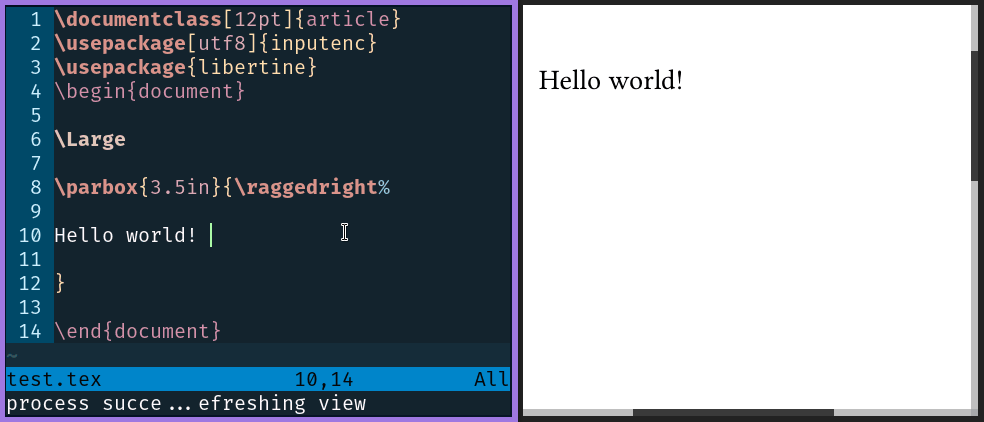
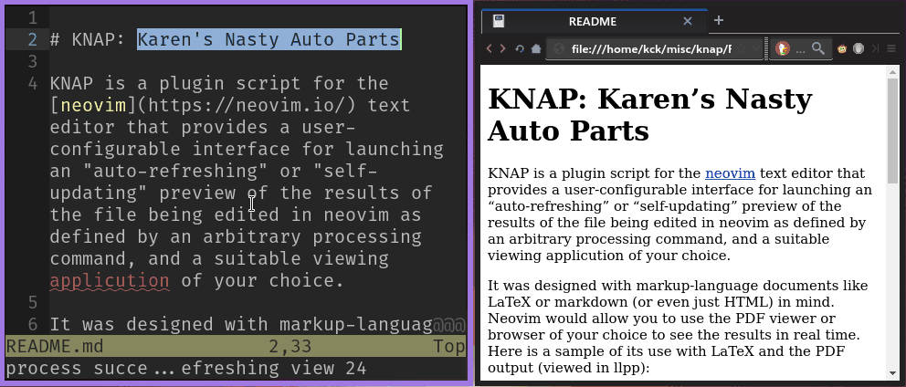

# KNAP: Kevin's Neovim Auto-Previewer

KNAP is a lua plugin for the [neovim](https://neovim.io/) text editor (version 0.7.0+) that provides a user-configurable interface for launching an “auto-refreshing” or “self-updating” preview of the results of the file being edited in neovim as defined by an arbitrary processing command, and a suitable viewing application of your choice.

It was designed with markup-language documents like LaTeX or markdown (or even just HTML) in mind. KNAP allows you to use the PDF viewer or browser of your choice to see the results in real time. Here is a sample of its use with a LaTeX file and its PDF output (here viewed in [llpp](https://github.com/moosotc/llpp)):



Moreover, in principle KNAP could be used for many different purposes, including seeing the results of a data calculation applied to a JSON, XML or CSV file, or the effects of editing a CSS file on a webpage. You just need to configure it to do so.

For LaTeX it also provides SyncTeX support, and could be extended for similar mechanisms for other formats, if and when they exist.

Similar tools exist. I created KNAP for myself and my own workflow, but perhaps others will find it useful, so I made it public. It’s only been tested on Linux; it *might* work on other Unix-y systems like FreeBSD/MacOS X (---it hasn't been tested, but try away---), but likely won’t work on Windows without modification. It presupposes you have enough understanding of command line interfaces to configure it properly, though there are some sample configurations below.

Live-preview of a markdown file, with the Falkon browser:



*Warning*: Unless you use the “[buffer as stdin](#user-content-using-buffer-as-stdin-rather-than-saving)” option, part of the way this works is that your file is constantly saved, with its usual filename. This may be dangerous for some people’s workflow, especially those who don’t make adequate backups. *Take care not to save over important work if you don't have a way to get it back (e.g., a previous git commit).*

## Table of Contents

* [Installation](#user-content-installation)
* [Invocation and Usage](#user-content-invocation-and-usage)
* [Configuring Routines](#user-content-configuring-routines)
* [Settings for SyncTeX or other “Jumps”](#user-content-settings-for-synctex-or-other-jumps)
* [Delay Setting / Speed Tuning](#user-content-delay-setting--speed-tuning)
* [Errors During Processing](#user-content-errors-during-processing)
* [Default Configuration](#user-content-default-configuration)
* [Setting a Different Root Document](#user-content-setting-a-different-root-document)
* [Buffer-Specific Settings / XeLaTeX Detection Example](#user-content-buffer-specific-settings--xelatex-detection-example)
* [Using Buffer As Stdin Rather Than Saving](#user-content-using-buffer-as-stdin-rather-than-saving)
* [Configuration Hints for PDF Viewers](#user-content-configuration-hints-for-pdf-viewers)
    - [Sioyek (recommended viewer)](#user-content-sioyek-recommended-viewer)
    - [llpp](#user-content-llpp)
    - [MuPDF](#user-content-mupdf)
    - [QpdfView](#user-content-qpdfview)
    - [Zathura](#user-content-zathura)
    - [Okular](#user-content-okular)
    - [apvlv](#user-content-apvlv)
    - [Evince (aka GNOME Document Viewer)](#user-content-evince-aka-gnome-document-viewer)
* [Configuration Hints for HTML Output / Browsers](#user-content-configuration-hints-for-html-output--browsers)
    - [Falkon](#user-content-falkon-recommended-browser)
    - [QuteBrowser](#user-content-qutebrowser)
    - [Firefox, Chrome, Chromium, etc.](#user-content-firefox-chrome-chromium-etc)
    - [Using a Live Server (works with any browser)](#user-content-using-a-live-server-works-with-any-browser)
* [Troubleshooting and Workarounds](#user-content-troubleshooting-and-workarounds)
* [License](#user-content-license)

## Installation

#### Manual Installation

Using git, simply clone this repo into an appropriate spot in your neovim runtimepath, e.g.:

```sh
$ mkdir -p ~/.local/share/nvim/site/pack/plugins/start
$ cd ~/.local/share/nvim/site/pack/plugins/start
$ git clone --depth 1 https://github.com/frabjous/knap.git

```

#### With a Neovim Package Manager

I believe knap can be installed with most neovim package managers. For example, with [paq](https://github.com/savq/paq-nvim) you can put:

```lua
require "paq" {
    "savq/paq-nvim";
    "frabjous/knap";
}
```
Different package managers work a little differently, so be sure to check the documentation for yours.

#### Other Requirements

Of course, you will also need whatever programs are needed for processing and viewing your files. For the [default configuration](#user-content-default-configuration), you'll need [Sioyek](https://sioyek.info) for viewing PDF output, [Falkon browser](https://www.falkon.org/) for html output, [pandoc](https://pandoc.org/) for processing markdown files, a TeX distribution such as [TeXlive](https://www.tug.org/texlive/) for LaTeX files, and [rubber](https://gitlab.com/latex-rubber/rubber/) for reporting LaTeX errors. The default settings assume you are using Sioyek 2.0+. On Linux, check your package manager to see if these are available in your distro’s repos. You don’t necessarily need them if you want to use a custom configuration instead.

## Invocation and Usage

Neovim will “lazily” load the plugin only when it is first called with a lua `require` that exposes the functions defined by the plugin. Most likely, you will want to map keys to require and call these functions. There are four functions it makes sense to call directly.

If you use the traditional `~/.config/nvim/init.vim` start up script, put something like this in it:

```vimscript
""""""""""""""""""
" KNAP functions "
""""""""""""""""""
" F5 processes the document once, and refreshes the view "
inoremap <silent> <F5> <C-o>:lua require("knap").process_once()<CR>
vnoremap <silent> <F5> <C-c>:lua require("knap").process_once()<CR>
nnoremap <silent> <F5> :lua require("knap").process_once()<CR>

" F6 closes the viewer application, and allows settings to be reset "
inoremap <silent> <F6> <C-o>:lua require("knap").close_viewer()<CR>
vnoremap <silent> <F6> <C-c>:lua require("knap").close_viewer()<CR>
nnoremap <silent> <F6> :lua require("knap").close_viewer()<CR>

" F7 toggles the auto-processing on and off "
inoremap <silent> <F7> <C-o>:lua require("knap").toggle_autopreviewing()<CR>
vnoremap <silent> <F7> <C-c>:lua require("knap").toggle_autopreviewing()<CR>
nnoremap <silent> <F7> :lua require("knap").toggle_autopreviewing()<CR>

" F8 invokes a SyncTeX forward search, or similar, where appropriate "
inoremap <silent> <F8> <C-o>:lua require("knap").forward_jump()<CR>
vnoremap <silent> <F8> <C-c>:lua require("knap").forward_jump()<CR>
nnoremap <silent> <F8> :lua require("knap").forward_jump()<CR>
```

Or if you use a lua config file such as `~/.config/nvim/init.lua`, you can put:

```lua
-- set shorter name for keymap function
local kmap = vim.keymap.set

-- F5 processes the document once, and refreshes the view
kmap('i','<F5>', function() require("knap").process_once() end)
kmap('v','<F5>', function() require("knap").process_once() end)
kmap('n','<F5>', function() require("knap").process_once() end)

-- F6 closes the viewer application, and allows settings to be reset
kmap('i','<F6>', function() require("knap").close_viewer() end)
kmap('v','<F6>', function() require("knap").close_viewer() end)
kmap('n','<F6>', function() require("knap").close_viewer() end)

-- F7 toggles the auto-processing on and off
kmap('i','<F7>', function() require("knap").toggle_autopreviewing() end)
kmap('v','<F7>', function() require("knap").toggle_autopreviewing() end)
kmap('n','<F7>', function() require("knap").toggle_autopreviewing() end)

-- F8 invokes a SyncTeX forward search, or similar, where appropriate
kmap('i','<F8>', function() require("knap").forward_jump() end)
kmap('v','<F8>', function() require("knap").forward_jump() end)
kmap('n','<F8>', function() require("knap").forward_jump() end)
```

Of course, feel free to choose other keys in place of <kbd>F5</kbd>-<kbd>F8</kbd>.

Here, the important key is <kbd>F7</kbd>. When first pressed, it will call the processing command (e.g., `pdflatex` or `pandoc`), and then open the viewer application. Then once changes are finished being made, after a very short delay, it will call the processing command again, and then send the command to “refresh” or “update” the preview.

Press it again to turn it off. When off, <kbd>F5</kbd> would manually process the file once and update the viewer, without this being a repeated cycle. <kbd>F6</kbd> would not only turn off auto-updating, but close the viewer, which is useful if you wish to change settings and use a different viewer, etc. If configured, <kbd>F8</kbd> would make the viewer application jump to the place in the output corresponding to the current cursor position in neovim, as with SyncTeX for LaTeX.

## Configuring Routines

Unless you are fully satisfied with the defaults (unlikely), you will need to configure knap. You may use either vimscript or lua for this. You must set one of two [dictionary](https://neovim.io/doc/user/eval.html#Dictionary) variables in neovim before knap is invoked, `g:knap_settings` (global setting; applied to all buffers) or `b:knap_settings` (buffer-specific). For most use cases, `g:knap_settings` is more appropriate. If you use `~/.config/nvim/init.vim`, you might put:

```vimscript
let g:knap_settings = {
    \ "texoutputext": "pdf",
    \ "textopdf": "pdflatex -synctex=1 -halt-on-error -interaction=batchmode %docroot%",
    \ "textopdfviewerlaunch": "mupdf %outputfile%",
    \ "textopdfviewerrefresh": "kill -HUP %pid%"
\ }
```

In lua you can assign `vim.b.knap_settings` or `vim.g.knap_settings` to an equivalent table. If you use `init.lua`, you can do:

```lua
local gknapsettings = {
    texoutputext = "pdf",
    textopdf = "pdflatex -synctex=1 -halt-on-error -interaction=batchmode %docroot%",
    textopdfviewerlaunch = "mupdf %outputfile%",
    textopdfviewerrefresh = "kill -HUP %pid%"
}
vim.g.knap_settings = gknapsettings
```

Most of the lines here are of the form `"setting": "value",`, or, in lua, `setting = "value",`. Together these define *routines*. Each routine is targeted at a file extension for a given type of input files; in the above example, the target extension is "`tex`", as the routine targets LaTeX (`.tex`) files.

The first setting (*outputext* or *output extension*) tells us that when `.tex` files are processed, the results are `.pdf` files, or that `.pdf` files are the files that need to be "previewed" when editing a `.tex` file. This determines what will be done with your file when knap is activated, depending on its extension. (If you are editing a file without an extension, the neovim `&filetype` setting will be used instead.)

This also tells the plugin that the *routine* we are defining is “`textopdf`”; the name of this routine is used in the other settings. Each routine has a name of the form `[input-extension]to[output-extension]`.

The main setting for the routine, which has the same name as the routine, is the command that is used to process the input file. In the example above, `pdflatex` (with some sane options) needs to be called to produce PDFs from LaTeX files. Someone else might prefer to configure it to use `xelatex` or `latexmk` instead; knap lets the user configure things how they wish.

Settings of the form `[routine]viewerlaunch` determine what command is used to initially launch the program used to view the output files. Once launched, the command in the setting of the form `[routine]viewerrefresh` is invoked whenever the input file is re-processed and the output file changes.

When invoked, the appropriate substitutions are made for these variables:

```text
 %srcfile%     the filename (full path) of the file being edited
 %docroot%     the base name of the root document that needs to be processed*
 %outputfile%  the base name of the output file**
 %pid%         the process id of the viewer program, after launch
 %line%        the line number of the cursor position in neovim
 %column%      the column number of the cursor position in neovim
 %servername%  the path to the RPC socket for the current neovim instance (v:servername)
```

\* In most use cases, the input document is the same as the one being edited, but see [Setting a Different Root Document](#user-content-setting-a-different-root-document) below for discussion of exceptions.

\*\* The output file is assumed to be the same as the root document with the output extension replacing the input extension of the routine.

Quotation marks will be wrapped around the filename variables; do not put additional quotation marks around them. If you need to use quotation marks elsewhere in the commands, be sure to escape them as `\"` when setting them in your `init.vim`/`init.lua`.

Note the commands are always invoked from within the directory of the root document, which may or may not be the same as the document being edited.

KNAP sets no limitations on what routines are defined for what file extensions, or how many routines are set inside `g:knap_settings`. Use a single dictionary for all such settings. For example, to have a routine to create HTML files from Markdown `.md` files, create the settings “`mdoutputext`”, “`mdtohtml`”, “`mdtohtmlviewerlaunch`” and “`mdtohtmlviewerrefresh`”. See the [defaults](#user-content-default-configuration) for examples.

Use the setting “none” in cases when no command needs to be issued to process a kind of file, or to refresh the viewer. (Some viewer applications are self-refreshing!) You can also define routines where the input extension and output extension are the same, e.g., `htmltohtml`, since nothing needs to be done to an html file to make it view-able in a browser.

Note also that it is harmless to have settings for different routines for the same input extension in your dictionary. E.g., you might have both `textopdf` and `textodvi` settings; the `texoutputext` variable will determine which one is used by default; however, you could do:

`:let b:knap_settings["texoutputext"] = "dvi"`

from the command line in neovim before invoking knap on a TeX file to use the `textodvi` routine to produce `.dvi` files instead of the default `textopdf` routine.

## Settings for SyncTeX or other “Jumps”

If the kind of processing tools and viewer software you’re using allow for it, you can create a command that will instruct the viewer to move to the part of the output corresponding to the current location in the source file, or in reverse, to instruct neovim to move to the part of the source corresponding to a portion of the output. This is possible, for example, with SyncTeX for LaTeX files.

For “forward” (source → output) jumps, you need to define a setting `[routine]forwardjump`; this may use the same variables as the other settings for the routines, and is where `%line%` and `%column%` are most likely to be relevant. See the default setting for `"textopdfforwardjump"` as an example below.

For “reverse” or “inverse” (output → source) jumps, you would in most cases configure the viewer to invoke a headless instance of neovim which will send an appropriate signal to the active instance via RPC and then immediately quit.

The `knaphelper.lua` file, when required by a lua command executed by a headless instance of neovim, exposes a function to help with this. The function takes the form `relayjump(servername, filename, line, column)`, which will instruct the neovim instance at `servername` to move its cursor to the specified line and column if `filename` is the file being edited (and just echoes a message otherwise). The viewer or some intermediary must be capable of determining the filename, line and column using SyncTeX or something similar. You could call this function with a headless instance of neovim like this:

```sh
nvim --headless -es --cmd "lua require('knaphelper').relayjump('%servername%','%{filename}%',%{line}%,%{column}%)"
```

If this command can be configured to be used by the viewer in a viewerlaunch or viewerrefresh action, `%servername%` may be passed as part of the command using the substitution method mentioned above; the values of `%{filename}%`, `%{line}%` and `%{column}%` must be provided by the viewer or a helper script. Note also that if one uses `'all'` for `servername`, it will relay the command to all instances of neovim whose RPC server socket it can find, which may be useful if there is no easy way to configure the viewer launching the headless instance to use a specific server.

## Delay Setting / Speed Tuning

Subsequent re-processing of the input file and refreshing the viewer is triggered by changes to the buffer being edited in neovim. Typically, one wishes to finish what one is typing before seeing the result, so there is a short delay between any given change and the start of the processing, and the delay timer is reset with each buffer change. This means that one must at least briefly pause editing before re-processing will start.

This delay is configured in milliseconds. Setting a shorter delay will speed up processing and make it more frequent. Setting this value appropriately involves a trade-off: a lower number is faster, but will make use of more computing resources (processor and memory usage, number of disk writes).

This delay is set to 250 milliseconds (a quarter second) by default. Depending on your hardware and the processing cost of the commands you're using, you may wish to lower or raise this. To do so, include a setting for “delay” in `g:knap_settings`; e.g., for 100 milliseconds, put this in `init.vim`:

```vimscript
let g:knap_settings = {
    \ ...
    \ "delay": 100,
    \ ...
}
```

Or in `init.lua`:

```lua
local gknapsettings = {
    ...
    delay = 100,
    ...
}
vim.g.knap_settings = gknapsettings
```

Or it can be set on an individual basis for a given buffer (before starting the autopreview), in neovim:

`:let b:knap_settings["delay"] = 100`

## Errors During Processing

If the processing command for the routine finishes with an error (non-zero exit status), an error message will be reported in neovim, and the command to refresh the viewer will not be sent until the command is run again successfully. Typically, the message will include the first line of the stderr stream for the process.

You can fine-tune this by adding a setting of the form `[routine]shorterror` which calls a command to return useful debugging info if one exists instead. The [default configuration](#user-content-default-configuration) uses `rubber-info` to collect information about the first error in the LaTeX logs when using the `textopdf` routine.

However, knap is not primarily designed to provide debugging or error checking capabilities.

## Default Configuration

The default settings are used only when neither `g:knap_settings` or `b:knap_settings` is set with the key in question when the plugin is invoked.

They determine only the following routines:

```text
textopdf            uses pdflatex for processing and sioyek for viewing/refreshing
mdtohtml (default)  uses pandoc for processing and falkon for viewing
mdtopdf             uses pandoc for processing and sioyek for viewing
htmltohtml          "none" for processing; falkon for viewing
```

The precise values are listed below, here using the lua syntax (though the syntax for vimscript is quite close). You are, however, expected and encouraged to create your own, but comparison with the precise default values may be of some use:

```lua
{
    htmloutputext = "html",
    htmltohtml = "none",
    htmltohtmlviewerlaunch = "falkon %outputfile%",
    htmltohtmlviewerrefresh = "none",
    mdoutputext = "html",
    mdtohtml = "pandoc --standalone %docroot% -o %outputfile%",
    mdtohtmlviewerlaunch = "falkon %outputfile%",
    mdtohtmlviewerrefresh = "none",
    mdtopdf = "pandoc %docroot% -o %outputfile%",
    mdtopdfviewerlaunch = "sioyek %outputfile%",
    mdtopdfviewerrefresh = "none",
    markdownoutputext = "html",
    markdowntohtml = "pandoc --standalone %docroot% -o %outputfile%",
    markdowntohtmlviewerlaunch = "falkon %outputfile%",
    markdowntohtmlviewerrefresh = "none",
    markdowntopdf = "pandoc %docroot% -o %outputfile%",
    markdowntopdfviewerlaunch = "sioyek %outputfile%",
    markdowntopdfviewerrefresh = "none",
    texoutputext = "pdf",
    textopdf = "pdflatex -interaction=batchmode -halt-on-error -synctex=1 %docroot%",
    textopdfviewerlaunch = "sioyek --inverse-search 'nvim --headless -es --cmd \"lua require('\"'\"'knaphelper'\"'\"').relayjump('\"'\"'%servername%'\"'\"','\"'\"'%1'\"'\"',%2,%3)\"' --new-window %outputfile%",
    textopdfviewerrefresh = "none",
    textopdfforwardjump = "sioyek --inverse-search 'nvim --headless -es --cmd \"lua require('\"'\"'knaphelper'\"'\"').relayjump('\"'\"'%servername%'\"'\"','\"'\"'%1'\"'\"',%2,%3)\"' --reuse-window --forward-search-file %srcfile% --forward-search-line %line% %outputfile%",
    textopdfshorterror = "A=%outputfile% ; LOGFILE=\"${A%.pdf}.log\" ; rubber-info \"$LOGFILE\" 2>&1 | head -n 1",
    delay = 250
}
```

We can see that the commands can look quite complicated. The complexity of the `texttopdf` routine commands for sioyek is explained [below](#user-content-sioyek-recommended-viewer).

## Setting a Different Root Document

Sometimes the document that needs to be processed is not actually the one being edited. It might be a supplementary file. This would happen with included packages, or subdocuments inserted in LaTeX via `\include` or `\input`. In such cases, the main document is considered the “root document”.

You can tell knap to process a document different from the one being edited by inserting a comment including the string “root = ” (without the quotes) in the first five lines of the file. The rest of the line is considered the root document’s name. So if editing `chapter1.tex` which is included in `main.tex`, at the top of `chapter1.tex`, you may put:

`% TeX root = main.tex`

Then it is `main.tex` that will be compiled when knap is invoked on `chapter1.tex`, not `chapter1.tex` itself.

(The “TeX” at the beginning is ignored by knap, but is useful for conformity with other editors and plug-ins that use a similar convention.)

This might be useful for other sorts of tricks as well. For example, you could set a CSS document’s “root” to be an HTML document that uses it, and thereby see the results of editing the CSS in an auto-preview; put:

`/* HTML root = index.html */`

Note that it is the *root* document’s extension that determines the routine used, so for the above CSS example, the routine is simply `htmltohtml`, and no separate `csstohtml` routine is required. The output file is also considered to have the same base name as the root document, not the edited document.

However, in such a case, it might be better to use “`touch %outputfile%`” for the main processing command rather than simply “none” if the viewer relies on detecting changes to trigger an auto-refresh. Only the CSS file is being changed, so the touch command is needed to mark the HTML file as changed as well, so the refresh will be triggered.

## Buffer-Specific Settings / XeLaTeX Detection Example

If you wish to use different settings for *some* but not all files with a given extension, this can be done in your neovim initialization file, by calling a function that places options in the `b:knap_settings` dictionary variable. (Note: use `b:` here rather than `g:` to avoid affecting all buffers in the neovim instance.)

As an example, here is a snippet you can place in `~/.config/nvim/init.vim` that will detect if a LaTeX file should be processed with `xelatex` rather than `pdflatex`. It does so if "`xelatex`" occurs in the first five lines (such as in a comment), or if the `mathspec`, `fontspec` or `unicode-math` package is loaded.

```vimscript
function XeLaTeXCheck()
    let l:xelatex = 0
    let l:xelatexcomment = search('xelatex','nw')
    if (l:xelatexcomment > 0) && (l:xelatexcomment < 6)
        let l:xelatex = 1
    else
        if (search('\\usepackage{[^}]*mathspec[^}]*}','nw')) ||
            \ (search('\\usepackage{[^}]*fontspec[^}]*}','nw'))
            let l:xelatex = 1
        endif
    endif
    if (l:xelatex == 1)
        if !exists("b:knap_settings") 
            let b:knap_settings = {}
        endif
        let b:knap_settings["textopdf"] = "xelatex -interaction=batchmode -halt-on-error -synctex=1 %docroot%"
endfunction
autocmd BufRead *.tex call XeLaTeXCheck()
```

(Note with this alone, this check would only be done when the file is loaded, unless you bind the function to another autocommand or key.)

A similar thing could be done in a lua init file to check the first 15 lines like so:

```lua
_G.xelatexcheck = function()
    local isxelatex = false
    local fifteenlines = vim.api.nvim_buf_get_lines(0,0,15,false)
    for l,line in ipairs(fifteenlines) do
        if (line:lower():match("xelatex")) or
           (line:match("\\usepackage[^}]*mathspec")) or
           (line:match("\\usepackage[^}]*fontspec")) or
           (line:match("\\usepackage[^}]*unicode-math")) then
           isxelatex = true
           break
       end
    end
    if (isxelatex) then
        local knapsettings = vim.b.knap_settings or {}
        knapsettings["textopdf"] = 
            'xelatex -interaction=batchmode -halt-on-error -synctex=1 %docroot%'
        vim.b.knap_settings = knapsettings
    end
end
vim.api.nvim_create_autocmd({'BufRead'}, {pattern = {'*.tex'}, callback = xelatexcheck})
```

These are just examples; there are other, possibly better ways of dealing with XeLaTeX detection outside of knap, e.g., by using a processing command that itself does this.

## Using Buffer As Stdin Rather Than Saving

A newly introduced feature allows you to avoid constantly saving over your file. Instead, you may set the routine to send the current contents of the buffer, as it changes, as stdin to the processing command. The file will not be saved each time the routine is called. You are then free to save your file as you normally would in neovim only when you wish to make changes permanent.

To use this option, add a key for `[routine]bufferasstdin` to the settings dictionary and set it to `v:true` in vimscript, or simply `true` in lua. For a “`textopdf`” routine, you might put:

```vimscript
let g:knap_settings = {
    \ "textopdf" : "pdflatex -jobname \"$(basename -s .pdf %outputfile%)\" -halt-on-error",
    \ "textopdfbufferasstdin" : v:true
\ }

```

Notice you will also need to change the processing command for the routine so that it reads from stdin rather than passing it the input filename or document root filename. All the usual flavors of LaTeX (PDFLaTeX, XeLaTeX, LuaLaTeX, etc.) are happy to read from standard in, though as above, you will need to use the `-jobname` option to ensure you get the right output filename. Unfortunately, using this option will cause SyncTeX not to work. (SyncTeX uses the input filename, which is not available to it with this option, which is why it is not used by default.)

For processing markdown, pandoc is happy to read from stdin as well, but you will need to set its input format with `-f`. E.g., if using lua in your configuration:

```lua
local gknapsettings = {
    mdtohtml = "pandoc -f markdown --standalone -o %outputfile%",
    mdtohtmlbufferasstdin = true
}
vim.g.knap_settings = gknapsettings
```

You may include redirections in your processing command if you need finer grained control of what is done with the buffer contents, such as writing to a temporary file.

## Configuration Hints for PDF Viewers

If you have managed to configure knap for any other open source PDF viewers, please let me know so I can add to this list.

These are listed roughly in order of how well they work in my experience.

Do not use Adobe Reader. Not just for this, but for anything or any reason.

### Sioyek (recommended viewer)

[sioyek project page](https://sioyek.info/)

Sioyek is fast, auto-refreshing PDF viewer with customizable vim-like keybinds and interesting features for viewing research papers and technical works. It supports SyncTeX well, and does not flicker much on reloads. In my experience, it overall provides the best experience with knap, and so is used as the default PDF viewer.

Since it is default, you need not put these settings in your `init.vim` unless you wish to tweak them:

```vimscript
let g:knap_settings = {
    \ "textopdfviewerlaunch": "sioyek --inverse-search 'nvim --headless -es --cmd \"lua require('\"'\"'knaphelper'\"'\"').relayjump('\"'\"'%servername%'\"'\"','\"'\"'%1'\"'\"',%2,0)\"' --new-windoow %outputfile%",
    \ "textopdfviewerrefresh": "none",
    \ "textopdfforwardjump": "sioyek --inverse-search 'nvim --headless -es --cmd \"lua require('\"'\"'knaphelper'\"'\"').relayjump('\"'\"'%servername%'\"'\"','\"'\"'%1'\"'\"',%2,0)\"' --reuse-window --forward-search-file %srcfile% --forward-search-line %line% %outputfile%"
}
```

These settings directly pass the correct configuration for inverse jumps to Sioyek when it is launched. Getting this right is difficult. Since this uses the regular vim syntax for forming strings, if a command contains a double quotation mark, it must be escaped as `\"`. This command for inverse searches must be passed as a single argument, so it must be in its own quotes for the shell to interpret it as such. Moreover the command itself involves quoted arguments for the headless neovim instance, which themselves involve quoted lua strings! Since single quotation marks in shell arguments must be inside double quotation marks, and vice versa, and the double quotation marks must be escaped for lua, one ends up with rather convoluted syntax such as `require('\"'\"'knaphelper'\"'\"')` which becomes simply `require('knaphelper')` when all the escaping and shell unquoting is done. (The same complications exist for setting them with lua, as can be seen in the default settings above.)

With the typical configuration, reverse searches in Sioyek are activated by enabling SyncTeX mode with <kbd>F4</kbd> and then right clicking a spot in the PDF.

*Note:* If you are using an older version of Sioyek (below version 2.0), you should change the settings to use `--new-instance` and `--reuse-instance` instead of `--new-window` and `--reuse-window`.

### llpp

[llpp github page](https://github.com/moosotc/llpp)

llpp is another great choice; both fast and capable, and does not flicker much on refresh.

To allow for SyncTeX support, it must be started with the `-remote` option, to listen to commands sent to a named pipe. The suggested knap settings for llpp for the `textopdf` routine below look complicated, because they first check to see if such a pipe exists, and create one if not. The pipe can also be used to send the refresh command.

Suggested settings:

```vimscript
let g:knap_settings = {
    \ "mdtopdfviewerlaunch": "llpp %outputfile%",
    \ "mdtopdfviewerrefresh": "kill -HUP %pid%",
    \ "markdowntopdfviewerlaunch": "llpp %outputfile%",
    \ "markdowntopdfviewerrefresh": "kill -HUP %pid%",
    \ "textopdfviewerlaunch": "PIPE=$XDG_RUNTIME_DIR/llpp-remote.pipe ; ([[ -p $PIPE ]] || mkfifo -m 600 $PIPE) && exec llpp -remote $PIPE %outputfile%",
    \ "textopdfviewerrefresh": "(echo reload > $XDG_RUNTIME_DIR/llpp-remote.pipe)",
    \ "textopdfforwardjump": "synctex view -i %line%:%column%:%srcfile% -o %outputfile% -x \"echo goto %{page} %{h} %{v} > $XDG_RUNTIME_DIR/llpp-remote.pipe\""
\ }
```

For SyncTeX reverse jumps, one cannot set it up to call a headless instance of neovim directly, as it outputs its arguments to its synctex-command in an incompatible way. One must make use of a helper script. One is provided by the plugin in the form of a luajit script called `synctex-inverse.lua` in the `llpp` subdirectory of the git repository. (It is assumed as a neovim user you have a luajit executable installed.) You should either copy this into a directory in your [`$PATH`](https://astrobiomike.github.io/unix/modifying_your_path), or add the llpp directory of the plugin repo to your `$PATH`, or call it using its full path. You can make it executable with `chmod a+x synctex-inverse.lua` if need be.

Set this lua script as your synctex-command in your `llpp.conf` file (typically at `~/.config/llpp.conf`), under “`<defaults`”. If it is in your `$PATH` and executable you can simply do:

`synctex-command='synctex-inverse.lua'`

If not you can use the full path and call luajit explicitly:

`synctex-command='luajit /home/<username>/.local/share/nvim/site/pack/plugins/start/knap/llpp/synctex-inverse.lua'`

Substitute your actual username for `<username>` and otherwise adjust the path if you installed knap elsewhere (e.g., substitute `paqs` for `plugins` if you used `paq`).

Shift-clicking in llpp will then activate this with the appropriate arguments, and it, in turn, will call SyncTeX and then run a headless instance of neovim to call the relayjump function to move the cursor to the appropriate spot.

### MuPDF

[mupdf project page](https://mupdf.com/)

MuPDF is extremely fast—perhaps the fastest open source PDF viewer there is. It is also flicker-free. Its main disadvantage is that it does not support SyncTeX. Still, it can be used as a viewer with knap.

It can be refreshed by sending the HUP signal. Here are example settings for a `textopdf` routine:

```vimscript
let g:knap_settings = {
    \ "mdtopdfviewerlaunch": "mupdf %outputfile%",
    \ "mdtopdfviewerrefresh": "kill -HUP %pid%",
    \ "markdowntopdfviewerlaunch": "mupdf %outputfile%",
    \ "markdowntopdfviewerrefresh": "kill -HUP %pid%",
    \ "textopdfviewerlaunch": "mupdf %outputfile%",
    \ "textopdfviewerrefresh": "kill -HUP %pid%",
    \ "textopdfforwardjump" : "false"
\ }
```

You might be able to kludge up partial jump-support using something like [xdotool](https://github.com/jordansissel/xdotool), but I'd recommend just using one of the viewers above instead, which are both based on MuPDF.

### QpdfView

[qdpfview project page](https://launchpad.net/qpdfview)

This is the best of the poppler-based viewers for this purpose, and it has excellent SyncTeX support.

Use the `--unique` option to allow refreshing the current document as opposed to opening a new one. Add the `#src` component for SyncTeX jumping and highlighting.

If you enable auto-refresh under Edit > Settings > Behavior in qpdfview, you can set the refresh command to “none”.

Example settings in `init.vim` for a `textopdf` routine:

```vimscript
let g:knap_settings = {
    \ "textopdfviewerlaunch": "qpdfview --unique --instance neovim %outputfile%",
    \ "textopdfviewerrefresh": "none",
    \ "textopdfforwardjump" : "qpdfview --unique --instance neovim %outputfile%#src:%srcfile%:%line%:%column%"
\ }
```

For SyncTeX inverse jumps, under Edit > Settings > Source editor in qpdfview, you can use:

`nvim --headless -es --cmd "lua require('knaphelper').relayjump('all','%1',%2,%3)"`

You can then invoke it with control-click in qpdfview.

If you don’t want to use auto-refresh, then use the same command as the launch command for refreshing; you will however probably need to set your window manager to prevent qpdfview from stealing focus while you’re typing. (How to do this and whether it can be done will depend on your window manager.)

### Zathura

[zathura project page](http://pwmt.org/projects/zathura)

Zathura is also a fast, auto-refreshing viewer with nice SyncTeX support, and keybindings (neo)vim users might like.

Its main disadvantage is it flickers when reloading far more than Sioyek, mupdf or llpp do.

Suggested settings for `textopdf`:

```vimscript
let g:knap_settings = {
    \ "textopdfviewerlaunch": "zathura --synctex-editor-command 'nvim --headless -es --cmd \"lua require('\"'\"'knaphelper'\"'\"').relayjump('\"'\"'%servername%'\"'\"','\"'\"'%{input}'\"'\"',%{line},0)\"' %outputfile%",
    \ "textopdfviewerrefresh": "none",
    \ "textopdfforwardjump": "zathura --synctex-forward=%line%:%column%:%srcfile% %outputfile%"
\ }
```

The above settings directly pass the correct configuration for inverse jumps to Zathura when it is launched, again using the kind of convoluted syntax discussed for Sioyek [above](#user-content-sioyek-recommended-viewer). Control-click in Zathura to start the jump.

### Okular

[okular project page](https://okular.kde.org/)

The capabilities and commands for Okular are quite similar to those for qpdfview. To auto-reload, be sure “Reload document on file change” is checked under Settings > Configure Okular > General. Then you can use “none” for the refresh command. Suggested settings for a `textopdf` routine:

```vimscript
let g:knap_settings = {
    \ "textopdfviewerlaunch": "okular --unique %outputfile%",
    \ "textopdfviewerrefresh": "none",
    \ "textopdfforwardjump" : "okular --unique %outputfile%'#src:%line% '%srcfile%"
\ }
```

To configure inverse searches, in Okular, go to Settings > Configure Okular > Editor, choose “Custom Text Editor”, and under Command, put:

`nvim --headless -es --cmd "lua require('knaphelper').relayjump('all','%f',%l,%c)"`

Inverse searches are invoked by shift-clicking in Okular.

### apvlv

[apvlv github page](https://github.com/naihe2010/apvlv)

Create the file `~/.apvlv` with the line:

`set autoreload = 1`

You can then use the settings such as these:

```vimscript
let g:knap_settings = {
    \ "textopdfviewerlaunch": "apvlv %outputfile%",
    \ "texttopdfviewerrefresh": "none",
    \ "textopdfforwardjump" : "false"
\ }
```

This works decently well for refreshing the view, but there is no SyncTeX support.

### Evince (aka GNOME Document Viewer)

[evince project page](https://wiki.gnome.org/Apps/Evince)

Evince auto-refreshes so again “none” can be used for that, and always uses a single instance. You can also specify a page number, which provides a simple SyncTeX forward search.

Sample configuration:

```vimscript
let g:knap_settings = {
    \ "textopdfviewerlaunch": "evince %outputfile%",
    \ "textopdfviewerrefresh": "none",
    \ "textopdfforwardjump" : "synctex view -i %line%:%column%:%srcfile% -o %outputfile% -x 'evince -i %{page+1} %outputfile%'",
\ }
```

To get more precise forward searches, or any kind of inverse searches, you’ll have to fiddle with DBus or use a DBus wrapper script such as [this](https://github.com/Vinno97/evince-synctex) or [this](https://github.com/latex-lsp/evince-synctex). If someone comes up with precise instructions for this, let me know, and I will post them here. I have never tried this, as it doesn’t seem worth it given the better alternatives. (The fact that the GNOME developers don't just put an option in evince to set a custom command shows their increasing disregard for the Unix philosophy.)

## Configuration Hints for HTML Output / Browsers

Again, if you have suggestions for other browsers or approaches, let me know.

### Falkon (recommended browser)

[Falkon project page](https://www.falkon.org/)

The KDE Falkon browser (formerly qupzilla) is my preferred solution, as it is a modern-standards browser that auto-reloads local pages (those served with the `file://` protocol). Since it reloads for you, you do not need a refresh command. For example, for a `mdtohtml` routine, the default configuration for the `mdtohtml` routine uses simply:

```vimscript
let g:knap_settings = {
    \ "mdtohtmlviewerlaunch" : "falkon %outputfile%",
    \ "mdtohtmlviewerrefresh" : "none",
\ }
```

### QuteBrowser

[QuteBrowser project page](https://qutebrowser.org/)

Qutebrowser is a highly configurable, keyboard-driven browser with a vim-inspired interface. Although it doesn’t auto-reload like Falkon does, it can be triggered to reload manually by means of its userscript ability. The knap package now comes with such a userscript. (Again, it is assumed as a neovim user you have a working luajit interpreter on your system.) To use it, locate the file `knap-userscript.lua` in the `qutebrowser/` subfolder of the knap plugin directory. Make it executable. Copy it into qutebrowser’s userscript directory, or create a symbolic link to it there. Depending on where knap was installed, and qutebrowser’s config files are located, the commands for this might be something like:

```
chmod a+x ~/.local/share/nvim/site/pack/plugins/start/knap/qutebrowser/knap-userscript.lua
mkdir -p ~/.config/qutebrowser/userscripts
ln -s ~/.local/share/nvim/site/pack/plugins/start/knap/qutebrowser/knap-userscript.lua \
      ~/.config/qutebrowser/userscripts/knap-userscript.lua
```

You can set qutebrowser to start this userscript as part of the viewer launch command. The script creates uniquely named temporary files (based on its first argument) that allow knap to locate the FIFO pipe it can use to send qutebrowser refresh commands. The recommended settings for this are the following:

```vimscript
let g:knap_settings = {
    \ "mdtohtmlviewerlaunch" : "SRC=%srcfile%; ID=\"${SRC//[^A-Za-z0-9]/_-_-}\"; qutebrowser --target window %outputfile% \":spawn --userscript knap-userscript.lua $ID\"",
    \ "mdtohtmlviewerrefresh" : "SRC=%srcfile%; ID=\"${SRC//[^A-Za-z0-9]/_-_-}\"; echo ':run-with-count '$(</tmp/knap-$ID-qute-tabindex)' reload -f' > \"$(</tmp/knap-$ID-qute-fifo)\"",
    \ "htmltohtml" : "none",
    \ "htmltohtmlviewerlaunch" : "SRC=%srcfile%; ID=\"${SRC//[^A-Za-z0-9]/_-_-}\"; qutebrowser --target window %outputfile% \":spawn --userscript knap-userscript.lua $ID\"",
    \ "htmltohtmlviewerrefresh" : "SRC=%srcfile%; ID=\"${SRC//[^A-Za-z0-9]/_-_-}\"; echo ':run-with-count '$(</tmp/knap-$ID-qute-tabindex)' reload -f' > \"$(</tmp/knap-$ID-qute-fifo)\"",
\ }
```

The first part of these commands creates a (most probably) unique identifier from the source file name to use as part of the temporary file names, and the same method is used later to locate these files to use their contents to arrange the refreshes.

You might also consider using the [live server method](#using-a-live-server-works-with-any-browser) described below.

### Firefox, Chrome, Chromium, etc.

The mainstream browsers don’t provide an easy way for an external application to refresh the displayed page if it is read directly with the `file://` protocol, at least short of using a webdriver. There are lots of potential workarounds for this, of greater and lesser complexity.

A simple but kludgy way around this is to add a tag of the form `<meta http-equiv="refresh" content="1" >` inside the `<head>...</head>` of the html to instruct the browser to reload the page every second.

With knap, if you wish to avoid adding this tag to your actual file, you can use a trick to create a separate dummy file with this added using `sed` and then point the browser to it instead. For example, for straight HTML and for markdown input files, use something like:

```vimscript
let g:knap_settings = {
    \ "htmltohtml": "A=%outputfile% ; B=\"${A%.html}-preview.html\" ; sed 's/<\\/head>/<meta http-equiv=\"refresh\" content=\"1\" ><\\/head>/' \"$A\" > \"$B\"",
    \ "htmltohtmlviewerlaunch": "A=%outputfile% ; B=\"${A%.html}-preview.html\" ; firefox \"$B\"",
    \ "htmltohtmlviewerrefresh": "none",
    \ "mdtohtml": "A=%outputfile% ; B=\"${A%.html}-preview.html\" ; pandoc --standalone %docroot% -o \"$A\" && sed 's/<\\/head>/<meta http-equiv=\"refresh\" content=\"1\" ><\\/head>/' \"$A\" > \"$B\" ",
    \ "mdtohtmlviewerlaunch": "A=%outputfile% ; firefox \"${A%.html}-preview.html\"",
    \ "mdtohtmlviewerrefresh": "none",
\ }
```
Replace `firefox` above with `chromium` or `google-chrome-stable`, etc., for other popular browsers.

Another good alternative is using a live server; see below.

### Using a Live Server (works with any browser)

It is possible to set up a local webserver to serve the file you’re working on, and have it refresh the file when it changes. Unlike some plugins, knap does not come prebundled with one in order to stay minimal, but it can work in conjunction with such tools. For example, one may make use of the node-based [local-server](https://github.com/tapio/live-server) package by Tapio Vierros. (Follow the instructions in its README for installation.)

One could then utilize settings such as the following:

```vimspcript
let g:knap_settings = {
    "htmltohtmlviewerlaunch": "live-server --quiet --browser=firefox --open=%outputfile% --watch=%outputfile% --wait=800",
    "htmltohtmlviewerrefresh": "none",
    "mdtohtmlviewerlaunch": "live-server --quiet --browser=firefox --open=%outputfile% --watch=%outputfile% --wait=800",
    "mdtohtmlviewerrefresh": "none",
\ }
```
You can replace “`firefox`” with the executable name for whichever browser you would prefer to use. It is usually necessary to use the `--wait=` option for live-server to avoid it attempting to reload the output file before it is completely written, but you may need to tweak the precise value (in milliseconds) depending on the speed of your processing routine.

Note that knap spawns its viewer in the background, detached from the neovim process. In order to avoid leaving the server running after you exit neovim, you may wish to add an autocommand to kill all live-server instances upon exit. For instance, in your `init.vim` you could put:

```vimscript
autocmd BufUnload * lua if (vim.b.knap_viewerpid) then os.execute("pkill -f live-server") end
```

## Troubleshooting and Workarounds

The developers of PDF viewers/browsers, etc., likely did not foresee their use for this purpose, and because of this, problems can arise. One of the most common issues occurs when the next cycle of the processing begins rewriting an updated version of the output file before the viewer is done reading it from the previous cycle. At worst, this can cause the viewer to malfunction or crash. And even when this doesn’t happen, it can create annoyances such as the viewer “losing your place” in the document and, e.g., scrolling back to the start of the document while you were editing the middle or end.

If you encounter this kind of difficulty, one thing to consider is raising the processing delay setting to 500 ms or higher; see [the info on this above](#delay-setting--speed-tuning). This might give the viewer the time it needs.

Another method that often alleviates such problems involves setting the processing command to write to a temporary file and only moving it to the desired location when the processing is completed. For example, suppose your original processing command were something like this:

```
"mdtohtml" : "pandoc --citeproc --bibliography=mybib.yaml %docroot% > %outputfile%",
```

Consider changing it to this:

```
"mdtohtml" : "tempout=\"/tmp/$(basename %outputfile%)\" ; pandoc --citeproc --bibliography=mybib.yaml > \"$tempout\" && mv \"$tempout\" %outputfile%",

```

Since moving a file is a much quicker process than writing it to begin with, this makes it far less likely for there to be a conflict between the routine writing the file and the viewer reading it simultaneously.

## License

[GPLv3](https://www.gnu.org/licenses/gpl-3.0.html). 

KNAP is free software: you can redistribute it and/or modify it under the terms of the GNU General Public License as published by the Free Software Foundation, either version 3 of the License, or (at your option) any later version.

This program is distributed in the hope that it will be useful, but *without any warranty*; without even the implied warranty of *merchantability* or *fitness for a particular purpose*. See the [GNU General Public License](https://www.gnu.org/licenses/gpl-3.0.html) for more details.

© 2022 Kevin C. Klement. <klement@umass.edu>
